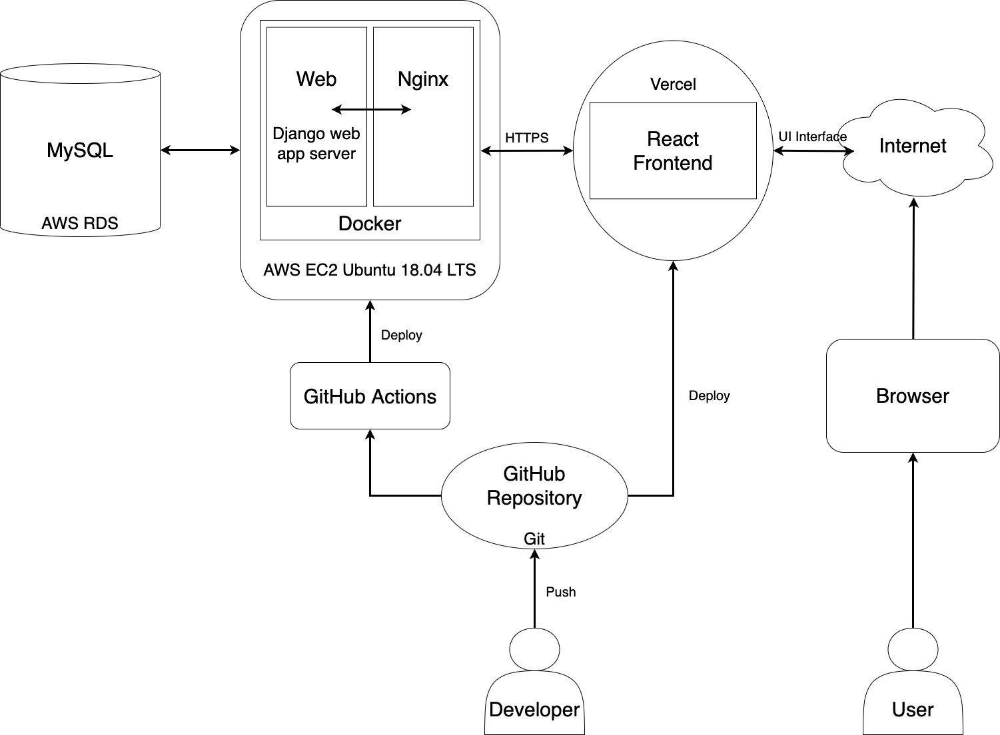

# MailedIt 15기 파트장 투표 서비스
- <a href="https://mailedit-vote.vercel.app/" target="_blank">투표하러 가기</a>
- <a href="https://documenter.getpostman.com/view/17298535/UVJbHd2g" target="_blank">API 문서</a>
- ERD\
  


## 협업 방식
- gitflow

협업 시의 충돌을 방지하고자 gitflow 방식으로 브랜치 관리
```
master
develop
  ㄴ  feature-account
  ㄴ  feature-vote
  ㄴ  feature-cookie
  ㄴ  feature-login
```

> 기능 추가할 때는 develop에서 분기하여 feature-name으로 브랜치 생성\
> `merge` feature -> develop \
> `merge` develop -> master


- 커밋 메시지 관리
  - 기능 추가 => "feat: message"
  - 기능 수정 => "fix: message"


## JWT 토큰 인증
simplejwt 라이브러리에서 일반적으로 사용하는 api 두개
- api/token
  - 로그인. 사용자 정보를 담은 `access token` & `refresh token` 토큰 생성해서 반환
- api/token/refresh
  - 유효한 refresh token을 담아 요청을 보내면 새로운 access token 반환

### 커스텀 세팅
```python
SIMPLE_JWT = {
    # access token 유효기간 하루로 설정
    "ACCESS_TOKEN_LIFETIME": timedelta(days=1),
    # refresh token 유효기간 7일로 설정
    "REFRESH_TOKEN_LIFETIME": timedelta(days=7),
    # Authorization 헤더에 JWT ~~ 형식으로 입력
    "AUTH_HEADER_TYPES": ("JWT",),
}
```

회원가입 시에도 토큰을 반환하도록 세팅
```python
from rest_framework_simplejwt.serializers import TokenObtainPairSerializer
class RegisterAPIView(APIView):
    def post(self, request):
        # 유저 생성
        user_serializer = RegisterSerializer(data=request.data)
        user = user_serializer.save()

        # 토큰 생성
        token = TokenObtainPairSerializer.get_token(user)
        refresh_token = str(token)
        access_token = str(token.access_token)
```
위 방식처럼 해도 되고, /api/token 으로 POST 요청을 보내도 되지만 굳이 요청 수를 늘리고 싶지 않았기 때문에 이렇게 했다😀

## 서버 셋업
- 개발 아키텍처\
  
- certbot을 사용한 HTTPS 인증 구현
  - certbot: Let's Encrypt 인증서를 사용하여 자동으로 HTTPS를 활성화하는 무료 오픈소스 소프트웨어 도구 
  - 도커에 certbot 컨테이너를 띄워 인증
    ```yml
    ...
    certbot:
        image: certbot/certbot:latest
        command: certonly --webroot --webroot-path=/var/www/certbot --email myemail@google.com --agree-tos --no-eff-email -d domain.com
        volumes:
            - /home/app/web/certbot/conf:/etc/letsencrypt
            - /home/app/web/certbot/logs:/var/log/letsencrypt
            - /home/app/web/certbot/data:/var/www/certbot
    ...
    ```
    - nginx 컨테이너 부분 아래에 certbot이라는 이름의 컨테이너를 위와 같은 설정으로 만들어 준다. 
    - 실행 후 인증서가 발급되면 certbot 컨테이너 부분은 지워준다. (지우지 않았을 경우 인증이 계속해서 실행되므로 자칫하면 이미 인증을 받은 상태임에도 인증을 다시 받는 상태가 될 수 있다.)
  - certbot을 통해 인증을 받으면 아래의 파일들을 고친 후 다시 배포한다. 
  - docker-compose.prod.yml
    ```yml
      ...
      nginx:
        container_name: nginx
        build: ./config/nginx
        volumes:
          - type: bind
            source: /home/app/web/certbot/conf/archive
            target: /etc/nginx/ssl
          - /home/app/web/certbot/data:/var/www/certbot
          - static:/home/app/web/static
          - media:/home/app/web/media
        ports:
          - "80:80"
          - "443:443"
        depends_on:
          - web
    ...
    ```
    - `bind` 를 통해 `/home/app/web/certbot/conf/archive` 의 파일(SSL 인증서, 키 파일)들을 nginx 컨테이너 속의 `/etc/nginx/ssl` 로 넣어준다. (bind가 아닌 기본 volume 방식으로 마운트 할 경우 엉뚱한 경로를 가리키게 되어 SSL 설정이 제대로 되지 않았다.)
    - https는 기본 포트로 443번을 사용하므로 `ports` 에 `"443:443"` 을 추가해 포트를 열어준다. 
  - nginx.conf
    ```conf
      upstream vote_mailedit {
        server web:8000;
      }

      server {

        listen 443 ssl;

        server_name vote-mailedit.kro.kr;

        ssl_certificate /etc/nginx/ssl/vote-mailedit.kro.kr/fullchain1.pem;
        ssl_certificate_key /etc/nginx/ssl/vote-mailedit.kro.kr/privkey1.pem;

        location / {
          proxy_pass http://vote_mailedit;
          proxy_set_header X-Forwarded-For $proxy_add_x_forwarded_for;
          proxy_set_header Host $host;
          proxy_redirect off;
        }

        location /static/ {
          alias /home/app/web/static/;
        }

        location /media/ {
          alias /home/app/web/media/;
        }

        location ~/.well-known/acme-challenge {
          allow all; 
          root /var/www/certbot;
        }
      }
    ```
    - 마찬가지로 443번 포트를 사용하도록 설정한다. 
    - Let's Encrypt에서는 유효성을 검사하기 위해 acme-challenge를 진행하므로 `~/.well-known/acme-challenge` 경로를 만들어 준다. 
    - acme-challenge를 통해 유효성 검사를 끝내고 인증서가 발급되면 각각 `ssl_certificate`, `ssl_certificate_key` 옆에 인증서와 키 파일의 경로를 입력한다.
  - Let's Encrypt에서 제공하는 인증서의 유효 기간은 90일이므로 주기적으로 인증서를 갱신해 주어야 한다. linux에서 제공하는 crontab 등의 스케줄링 시스템을 사용하여 certbot을 통해 자동으로 인증서를 갱신하도록 관리할 수도 있다. 

## 과제 회고
- Google, Naver 등의 소셜로그인 구현 가능성(?)

이번 과제에 소셜 로그인을 적용해보기 위해서 레퍼런스를 엄청나게 많이 찾아보았고, 흐름을 이해하는 게 어려웠다. 시간이 부족해서 구현은 못했지만.. 이번에 공부한 내용을 바탕으로 본 서비스에는 반영하려고 한다. 지금까지 이해한 흐름은 아래와 같다.
> 1. [프론트] `구글로 로그인하기` 버튼 누르면 구글 API에 요청을 보내서 로그인 창으로 이동
>> 이동할 때 redirect_uri 지정해서 로그인 완료했을 때 어디로 이동할지 세팅
> 2. [프론트] 사용자가 로그인하면 redirect_uri로 이동
>> 이때 google에서 query_parameter에다가 `해당 사용자에 부여한 code` 넣어줌
> 3. [프론트] 해당 코드를 백엔드 서버로 전송
>> 백엔드와 협의해서 미리 설정한 API 로 전송
> 4. [백엔드] 요청을 받은 후, 해당 코드를 담아서 다시 구글 서버에 요청
>> 이때 구글 서버에서는 코드가 유효한지 확인하고, 유효하다면 access_token과 refresh_token, 그리고 필요하다면 사용자 정보 담아서 응답
>>
>> `code`를 보내면 `token`을 준다고 생각하면 편하다.
> 5. [백엔드] 응답받은 access_token과 refresh_token을 프론트에게 전송
> 6. [프론트] 이후 요청할 때 access_token을 헤더에 담아서 요청

- https 인증 관련해서 삽질을 많이해서 힘들었다😂😂


## 참고문헌
- [Django 소셜로그인](https://koreanblacklee.github.io/posts/djangsociallogin/)
- [[SSL] Let's Encrypt - Certbot docker를 이용하여 SSL 인증서 발급받기](https://velog.io/@hytenic/SSL-Lets-Encrypt-Certbot-docker%EB%A5%BC-%EC%9D%B4%EC%9A%A9%ED%95%98%EC%97%AC-SSL-%EC%9D%B8%EC%A6%9D%EC%84%9C-%EB%B0%9C%EA%B8%89%EB%B0%9B%EA%B8%B0)